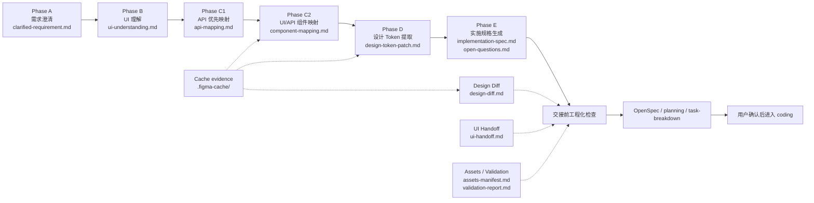

# agent-skills

面向 Codex 和 Claude Code 的共享技能仓库。仓库里的每个技能都保持独立目录,可作为 Codex standalone skill 使用,也可通过 Claude Code plugin 分发。

当前主要套件是 `figma-workflow-suite`:围绕 Figma 设计稿、需求澄清、接口结构和 UI/API 映射,生成 coding 前可审阅的 Markdown 实施材料。该套件只负责设计实现准备和工程化检查,不会直接写业务代码。

## figma-workflow-suite

`figma-workflow` 是入口编排器,按 `docs/design/<feature>/` 下的产物状态推进 Phase A-E,并在 handoff 前展示工程化检查点。



主链路保持 7 个 skill:`figma-workflow` + Phase A-E 的 6 个阶段 skill。工程化能力按需使用,不改变 Phase A-E 的 coding boundary。

### 主链路技能

- `figma-workflow`:按 `docs/design/<feature>/` 产物状态驱动 workflow,展示进度面板、review gate、工程化检查和 handoff 出口
- `figma-clarify-requirement`:把用户需求整理成 `clarified-requirement.md`(phase A)
- `figma-ui-understand`:从 Figma node 提取页面结构和 UI 语义,输出 `ui-understanding.md`(phase B)
- `figma-api-first`:把接口结构整理成 `api-mapping.md`(phase C1)
- `figma-ui-api-mapper`:清理 Figma 节点,合并 `api-mapping.md`,输出 `component-mapping.md`(phase C2,renamed from `figma-api-mapper`)
- `figma-design-token`:从 Figma node 抽取视觉 token,输出 `design-token-patch.md`(phase D)
- `figma-emit-spec`:合并上游产物,输出 `implementation-spec.md` + `open-questions.md`,提供 handoff 出口(phase E)

### 工程化技能

- P12 `figma cache layer`:在 `docs/design/<feature>/.figma-cache/` 缓存 Figma MCP evidence,供 C2/D 和后续 diff 复用
- P13 `figma-design-diff`:基于 `.figma-cache/` before/current evidence 生成 `design-diff.md`,提示 recommended rerun phases
- P14 `figma-ui-handoff`:生成 `ui-handoff.md`,帮助设计/产品补齐上游交接信息
- P15 `figma-assets-validate`:生成 `assets-manifest.md` 与 `validation-report.md`,收口资源交付和自动化验证

## 其它技能

- `document-analysis`：理解、摘要并审阅文档
- `project-interview-analyzer`：把项目整理成面试材料
- `git-commit`：安全审查改动并生成提交
- `markitdown-export`：将 PDF、Word、Excel 等文件转换为同目录 Markdown
- `markdown-lint`：清理并规范 Markdown 文件格式
- `kabu-story`：为 3 到 4 岁儿童生成低认知负担、高情绪共鸣的故事

## 安装

推荐使用混合安装：

- Codex 使用 standalone skills
- Claude Code 使用 `ethan-skills` plugin

这样做的好处是：

- Codex 侧触发更直接，兼容性更稳
- Claude Code 侧保留 `skill · ethan-skills` 这种带命名空间的展示

```bash
./scripts/install.sh
```

执行后：

- Codex 会把技能同步到本地 `~/.codex/skills`
- Claude Code 会自动注册本仓库为 marketplace，并安装或更新 `ethan-skills@ethan-skills`
- 脚本会顺手清理这套仓库在相反安装形态下留下的重复项

如果你明确想以 standalone skills 方式安装，再执行：

```bash
./scripts/install.sh skills
```

这会只安装到 Codex 的 `~/.codex/skills`，不会再改动 Claude Code。

## 更新

仓库更新后，重新运行同一个脚本即可刷新已安装内容。推荐继续使用默认混合模式：

```bash
./scripts/install.sh
```

如果你使用的是 standalone skills 模式，再执行：

```bash
./scripts/install.sh update
```

`update` 会刷新默认混合模式，也就是：

- Codex 更新 standalone skills
- Claude Code 更新 `ethan-skills` plugin
- 清理这套仓库在另一种安装形态下留下的重复项

## 目标路径

- Codex skills：`~/.codex/skills`
- Claude Code skills：`~/.claude/skills`
- Claude Code plugin：`~/.claude/plugins/ethan-skills`

## 技能结构

每个技能都放在独立目录里，并保持统一结构：

- `SKILL.md`
- `agents/openai.yaml`
- `references/`
- `scripts/`
